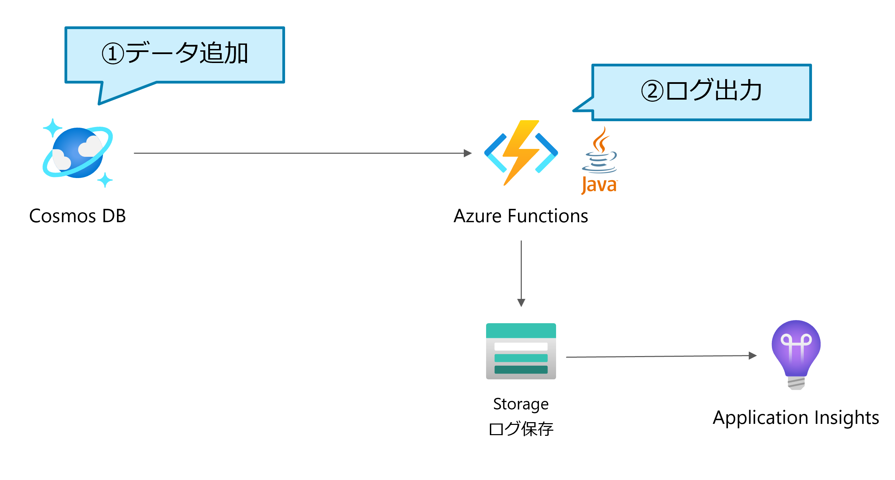

# Azure Cosmos DB Trigger Function in Java

このコンテンツは、 Azure Study #5 PaaS 編用に作成されました。

内容
=================

アーキテクチャ
=================



## Getting Started

### 1. 前提

以下のツールをインストールしてください。

- Microsoft Azure Subscription
- java 8 or higher
- Cosmos DB Emulator ([インストール方法](https://docs.microsoft.com/ja-jp/azure/cosmos-db/local-emulator?tabs=ssl-netstd21))
- Storage Emulator ([インストール方法](https://docs.microsoft.com/ja-jp/azure/storage/common/storage-use-azurite?toc=%2Fazure%2Fstorage%2Fblobs%2Ftoc.json&tabs=visual-studio))

#### あると望ましいもの

- `az` command
- Visual Studio Code ([インストール方法](https://code.visualstudio.com/download))

### 2. ローカルで Azure Functions を開発

Cosmos DB Emulator と Storage Emulator を起動してください。

また、 `local.settings.json` を作成し、以下のように編集してください。

(`local.settings.sample.json` は、`local.settings.json` のサンプルです。)

```json
{
  "IsEncrypted": false,
  "Values": {
    "AzureWebJobsStorage": "UseDevelopmentStorage=true",
    "AzureCosmosDBConnection": "AccountEndpoint=https://localhost:8081/;AccountKey=C2y6yDjf5/R+ob0N8A7Cgv30VRDJIWEHLM+4QDU5DE2nQ9nDuVTqobD4b8mGGyPMbIZnqyMsEcaGQy67XIw/Jw==",
    "FUNCTIONS_WORKER_RUNTIME": "java"
  }
}
```

[F5] ボタンを押し、作成した Azure Functions をローカルで実行します。

これにより、 Azure でリソースを作成せずとも、ローカルで Azure Functions を開発できるため、便利です。
メリットの一つとして、本番環境のデータに触ることなく開発を行うことができます。

### 3. Azure リソースの作成

`azure-templates/README.md` にある [Deploy to Azure] ボタンをクリックし、Azure にリソースを作成します。

### 4. サンプルデータを追加し、ログストリームを確認します。

以下のようなサンプルデータを Cosmos DB に追加します。

```json
{
    "id": "mocha",
    "firstname": "cuteMocha"
}
```

Azure Portal や Visual Studio Code から、 Azure Functions のログストリームを確認します。以下のようなログが出力されていたら、成功です。

```log
2021-08-16T09:46:21.533 [Information] Executing 'Functions.cosmosDBMonitor' (Reason='New changes on collection Persons at 2021-08-16T09:46:21.5332120Z', Id=5da9b5c3-1801-438b-985e-ff1cdf4973b1)
2021-08-16T09:46:21.571 [Information] 1 item(s) is/are changed.
2021-08-16T09:46:21.571 [Information] Function "cosmosDBMonitor" (Id: 5da9b5c3-1801-438b-985e-ff1cdf4973b1) invoked by Java Worker
2021-08-16T09:46:21.571 [Information] Executed 'Functions.cosmosDBMonitor' (Succeeded, Id=5da9b5c3-1801-438b-985e-ff1cdf4973b1, Duration=38ms)
2021-08-16T09:46:21.572 [Information] {"id":"mocha","_rid":"muM-AOhNRV4MAAAAAAAAAA==","_self":"dbs/muM-AA==/colls/muM-AOhNRV4=/docs/muM-AOhNRV4MAAAAAAAAAA==/","_ts":1629107180,"_etag":"\"00004628-0000-2300-0000-611a33ec0000\"","firstname":"cuteMocha","_lsn":125}
```
