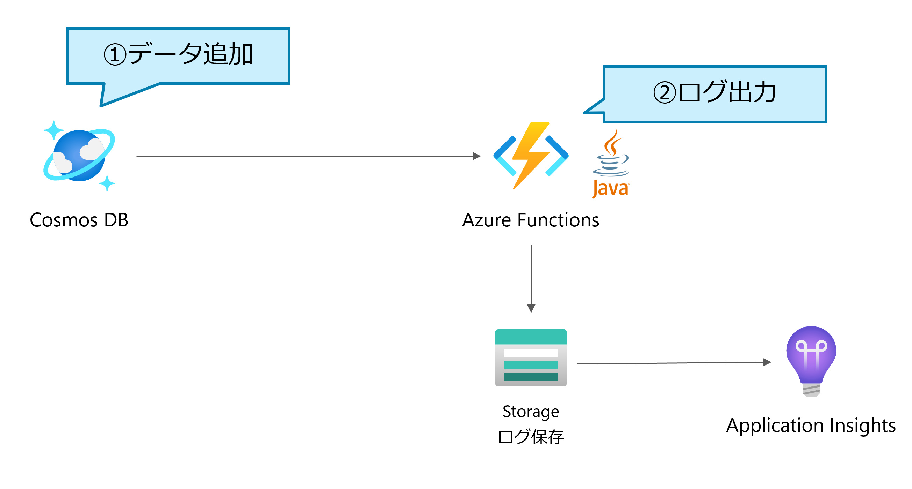

# Azure Cosmos DB Trigger Function in Java

This content was created for Azure Study #5 demo.

Table of Contents
=================

- [Azure Cosmos DB Trigger Function in Java](#azure-cosmos-db-trigger-function-in-java)
- [Table of Contents](#table-of-contents)
- [Architecture](#architecture)
  * [Getting Started](#getting-started)
    + [1. Prerequisites](#1-prerequisites)
      - [Optional](#optional)
    + [2. Develop functions locally](#2-develop-functions-locally)
    + [3. Create Azure resources](#3-create-azure-resources)
    + [4. Add a sample data and Check the Log stream](#4-add-a-sample-data-and-check-the-log-stream)

Architecture
=================



## Getting Started

### 1. Prerequisites

- Microsoft Azure Subscription
- java 8 or higher
- Cosmos DB Emulator ([How to install](https://docs.microsoft.com/en-us/azure/cosmos-db/local-emulator?tabs=ssl-netstd21))
- Storage Emulator ([How to install](https://docs.microsoft.com/en-us/azure/storage/common/storage-use-azurite?toc=%2Fazure%2Fstorage%2Fblobs%2Ftoc.json&tabs=visual-studio))

#### Optional

- `az` command
- Visual Studio Code ([How to install](https://code.visualstudio.com/download))

### 2. Develop functions locally

Start Cosmos DB Emulator and Storage Emulator.

Create `local.settings.json` and edit it like below.

(`local.settings.sample.json` is the sample file. Replace it with `local.settings.json`.)

```json
{
  "IsEncrypted": false,
  "Values": {
    "AzureWebJobsStorage": "UseDevelopmentStorage=true",
    "AzureCosmosDBConnection": "AccountEndpoint=https://localhost:8081/;AccountKey=C2y6yDjf5/R+ob0N8A7Cgv30VRDJIWEHLM+4QDU5DE2nQ9nDuVTqobD4b8mGGyPMbIZnqyMsEcaGQy67XIw/Jw==",
    "FUNCTIONS_WORKER_RUNTIME": "java"
  }
}
```

### 3. Create Azure resources

Just click  button in `azure-templates/README.md`.

### 4. Add a sample data and Check the Log stream

Add a sample data like below.

```json
{
    "id": "mocha",
    "firstname": "cuteMocha"
}
```

Here is an example of log stream.

```log
2021-08-16T09:46:21.533 [Information] Executing 'Functions.cosmosDBMonitor' (Reason='New changes on collection Persons at 2021-08-16T09:46:21.5332120Z', Id=5da9b5c3-1801-438b-985e-ff1cdf4973b1)
2021-08-16T09:46:21.571 [Information] 1 item(s) is/are changed.
2021-08-16T09:46:21.571 [Information] Function "cosmosDBMonitor" (Id: 5da9b5c3-1801-438b-985e-ff1cdf4973b1) invoked by Java Worker
2021-08-16T09:46:21.571 [Information] Executed 'Functions.cosmosDBMonitor' (Succeeded, Id=5da9b5c3-1801-438b-985e-ff1cdf4973b1, Duration=38ms)
2021-08-16T09:46:21.572 [Information] {"id":"mocha","_rid":"muM-AOhNRV4MAAAAAAAAAA==","_self":"dbs/muM-AA==/colls/muM-AOhNRV4=/docs/muM-AOhNRV4MAAAAAAAAAA==/","_ts":1629107180,"_etag":"\"00004628-0000-2300-0000-611a33ec0000\"","firstname":"cuteMocha","_lsn":125}
```
